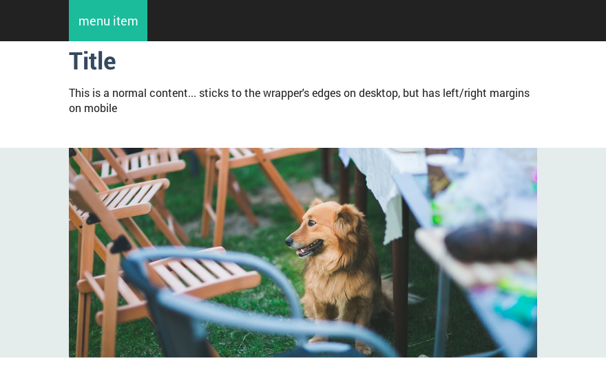
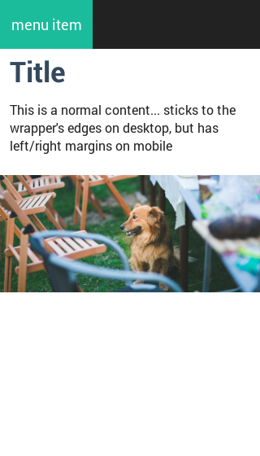

# Layout

There were several aspects when creating the layout for this toolset:

1. Responsiveness: wanted fine-grained possibilities for manipulating what is visible and when across devices;
2. Wanted to freely set elements to be within a wrapper or to fit the entire page width, even within a single page;
3. Wanted to have the possibility to both 'stick together' grid columns and/or to have gutter between them.

## Responsive Coolness

There are 5 layouts defined out of the box, with these defaults:

| Name   | Screen width (px) | Screen width (em) | Wrapper width | Refer to         |
|--------|:-----------------:|:-----------------:|---------------|------------------|
| **xs** | < 568px           | < 35.5em          | 100%          | `$screen-xs-max` |
| **sm** | 568px - 768px     | 35.5em - 48em     | 100%          | `$screen-sm-min` |
| **md** | 768px - 1024px    | 48em - 64em       | 100%          | `$screen-md-min` |
| **lg** | 1024px - 1280px   | 64em - 80em       | 960px (60em)  | `$screen-lg-min` |
| **xl** | > 1280px          | > 80em            | 1248px (78em) | `$screen-xl-min` |


All these can be changed of course depending on the project's needs. I even had a project where I completely had to get rid of the xl layout - not a problem.

### Basic Layout Rules

Unless you want a completely fluid layout, there are two major classes you need to use for playing with variations: `.wrapper` and `.content`.

*Wrapper* is the class that keeps your elements in the middle of the site, that is the "meat's width". This will be 100% on mobile layouts and the appropriate fixed width on desktops.

*Content* is the class that helps you prevent items from "sticking" to edges of the wrapper or the screen. Content is usually a direct child of a wrapper div.

Example:

```
<body>
  <nav><!-- Black stripe the fills the entire width-->
    <div class="wrapper">
      <a href="#">menu item</a><!-- it always sticks to the wrapper's edges -->
    </div>
  </nav>
  <div class="wrapper">
    <div class="content">
      <h1>Title</h1>
      <p>This is a normal content...</p><!-- sticks to the wrapper's edges on desktop, but has left/right margins on mobile-->
    </div>
  </div>
  <div class="jumbotron"><!-- fills entire width (but that has nothing to do with .jumbotron class -->
    <div class="wrapper">
       <!-- image that fills the entire wrapper on desktop and the entire screen width on mobile -->
    </div>
  </div>
  </div>
</body>
```

Result on desktop:



Result on mobile:

